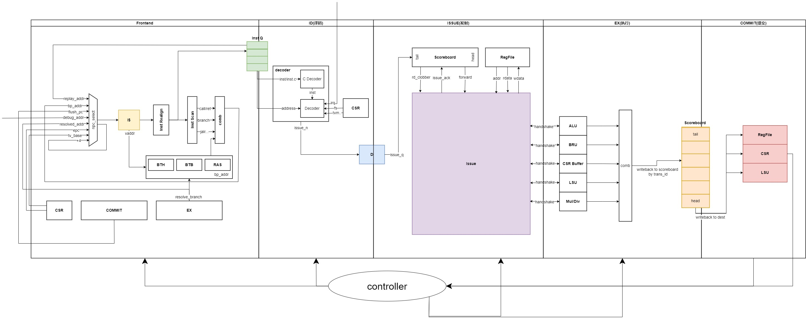
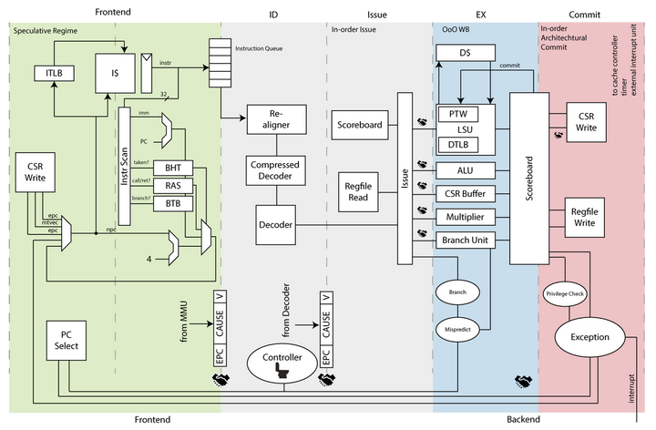

# MikuCPU规划

本项目使用CHISEL开发，预计用于2024年龙芯杯的MIPS/LoongArch赛道。现阶段的开发计划如下：

###### 1. 2023.10——2024.1

- 以cva6为参照，实现一个单发射、乱序执行（记分牌算法）、顺序提交的CPU核。
- 通过LoongArch2023发布包中功能测试与性能测试。
- 完成chiplab（LoongArch）搭建，尝试在仿真环境下启动linux。

###### 2. 2024.1——2024.4

- 设计超标量架构，并完成Linux的启动

###### 3. 其他

- （可选）设计一个帮助调参的C语言的模拟器
- （可选）适配IDEA的开发环境（vscode的Metals有点难搞）
- （可选）统一用scalafmt格式化代码

- 参考香山的代码，在CHISEL中加入debug代码

# 代码规范

代码规范主要参照自香山南湖架构的代码。

- 类名和对象名的单词首字母大写，单词中间不得出现下划线（大驼峰）。如果名称太长需要部分单词需要简写需要在代码注释中写明全称。

  ```scala
  //Has Prediction Constants
  trait HasPdConst[T <: Data]{
      ...
  }
  ```

- 信号名/变量名以下划线命名法命名。

  - 位于模块内部不同流水级的相同信号则采用<流水级>+<下划线>+<信号名>的方式命名。

  - 中间变量采用如下两种命名法：
    - 端到端命名：像连线一样，A_to_B

    - 功能性命名：常以动词开头的命名，如：save_next_pc，可在寄存器上使用。控制类信号统一在结尾加上en。


  ```scala
    // 1
    val f0_valid                             = Wire(Bool())
    val f0_ftq_req                           = Wire(Bool())
    val f1_valid							   = RegNext(f0_valid)
  
    // 2
    val BPU_to_pc_en                         = Wire(Bool())
    val set_predict_state					   = Wire(UInt(2))
    
  ```

- 模块使用到的参数统一置于trait中。(参数名称均大写+下划线命名法)

  ```scala
  //wrong
  class BPU extends Module{
  	val io = IO(...)	
  	val WAY_SIZE = 123
      val BANK_SIZE = 456
      ...
  }
  
  //right
  trait BPUParams with {<other relevant trait>}{
      val WAY_SIZE = 123
      val BANK_SIZE = 456
  }
  
  class BPU extends Module with BPUParams{
      val io =IO{...}
  }
  ```

- 定义继承自Module类和Bundle类的抽象类MikuModule和MikuBundle，方便配置核的参数

  ```scala
  class MikuMoudle extends Module{
  	val VADDR_WIDTH = 32
  }
  
  class IFU extends MikuModule{
      val pc = Input(UInt(VAddrWidth.W))
  }
  ```

  

- Tab缩进设定为4个空格

- 模块的所有输入信号位于变量in中，输出信号位于变量out中

  ```scala
  class BPU extends Module{
      val io = IO(
  	    val in = new Bundle{
          	val fromIfu = Input(...)
          }
  	    val out = new Bundle{
          	val toIfu = Output(...)
          }
      )
      
  }
  ```

- 原则上所有输入输出端口都位于能够多次复用的Bundle类中，不能直接是Bool、UInt、Vec

  ```scala
  //wrong
  class BPU extends Module{
      val io = IO(
      	val in = new Bundle{
  			val pc = Input(UInt(32.W))
  			val redirect = Input(Bool())
          	val redirectInfo = Input(UInt(RedirectInfo.W))
          }
  		val out = new Bundle{
  			val taken = Output(Bool())
  			val target = Output(UInt(32.W))
          }
      )
  	
  }
  
  //right
  class IfuToBpu extends Bundle{
      val valid = Bool()
      val pc = UInt(32.W)
      val redirect = Bool()
      val info = UInt(RedirectInfo.W)
  }
  
  class BpuResp extends Bundle{
      val valid = Bool()
      val taken = Output(Bool())
      val target = Output(UInt(32.W))
  }
  
  class BPU extends Module{
      val io = IO(
      	val in = Input(new IfuToBpu)
          val out = Output(new BpuResp)
      )
  }
  ```

- 连线可以通过函数的方式完成

  ```scala
    def toCtrlFlow: CtrlFlow = {
      val cf = Wire(new CtrlFlow)
      cf.instr := inst
      cf.pc := pc
      cf.foldpc := foldpc
      cf.exceptionVec := 0.U.asTypeOf(ExceptionVec())
      cf.exceptionVec(instrPageFault) := ipf
      cf.exceptionVec(instrAccessFault) := acf
      cf.trigger := triggered
      cf.pd := pd
      cf.pred_taken := pred_taken
      cf.crossPageIPFFix := crossPageIPFFix
      cf.storeSetHit := DontCare
      cf.waitForRobIdx := DontCare
      cf.loadWaitBit := DontCare
      cf.loadWaitStrict := DontCare
      cf.ssid := DontCare
      cf.ftqPtr := ftqPtr
      cf.ftqOffset := ftqOffset
      cf
    }
  }
  ```

- 多使用匿名函数，这会让代码变得很酷，不懂scala的人看不懂代码！（比如这个抽象的多路选择器）

  ```scala
  class PriorityMuxGenerator[T <: Data] {
      var src: List[(Bool, T, String)] = List()
      var num: Int = 0
      def genPortName(n: Option[String]): String = {
          num = num + 1
          n match {
              case Some(name) => name
              case None => {
                  "in" + num.toString()
              }
          }
      }
  
      def register(sel: Bool, in: T, name: Option[String] = None) = {
          src = (sel, in, genPortName(name)) :: src
      }
      def register(in: Seq[(Bool, T, Option[String])]) = {
          src = in.toList.map{ case (b, t, n) => (b, t, genPortName(n)) } ::: src
      }
      def register(sel: Seq[Bool], in: Seq[T], name: Seq[Option[String]]) = {
          src = (sel,in,name.map(genPortName)).zipped.toList ::: src
      }
      def apply(): T = {
          val names = src.map(_._3)
          val ins = src.map(s => (s._1, s._2))
          // we should use this sample data to get type and width
          // ugly
          val sample = ins(0)._2
          val ppm = Module(new PriorityMuxModule(sample)(names))
          (ppm.ins zip ins).foreach {
              case (in, (b, t)) => {
                  in.sel := b
                  in.src := t
              }
          }
          ppm.out.res
      }
  }
  ```

- 不要往仓库正在开发的主分支里提交不能运行的东西！
- （未完待续，总之整体风格参照香山的代码https://github.com/OpenXiangShan/XiangShan）

# 参考设计



