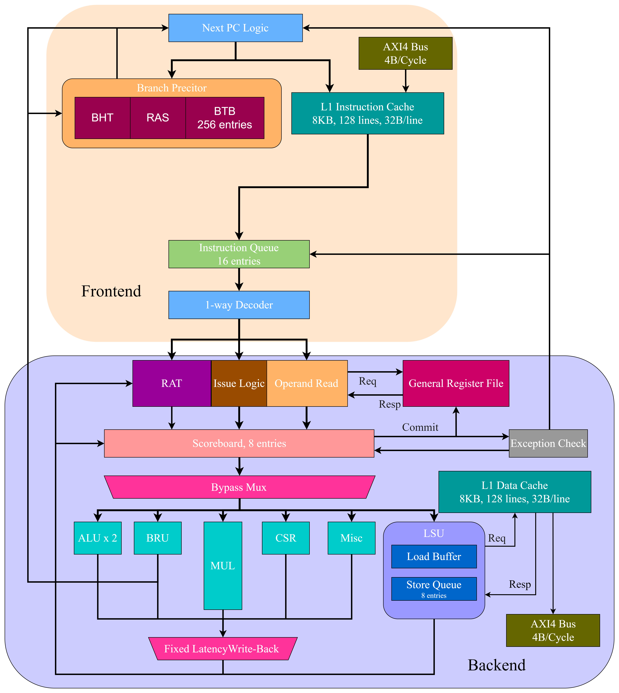
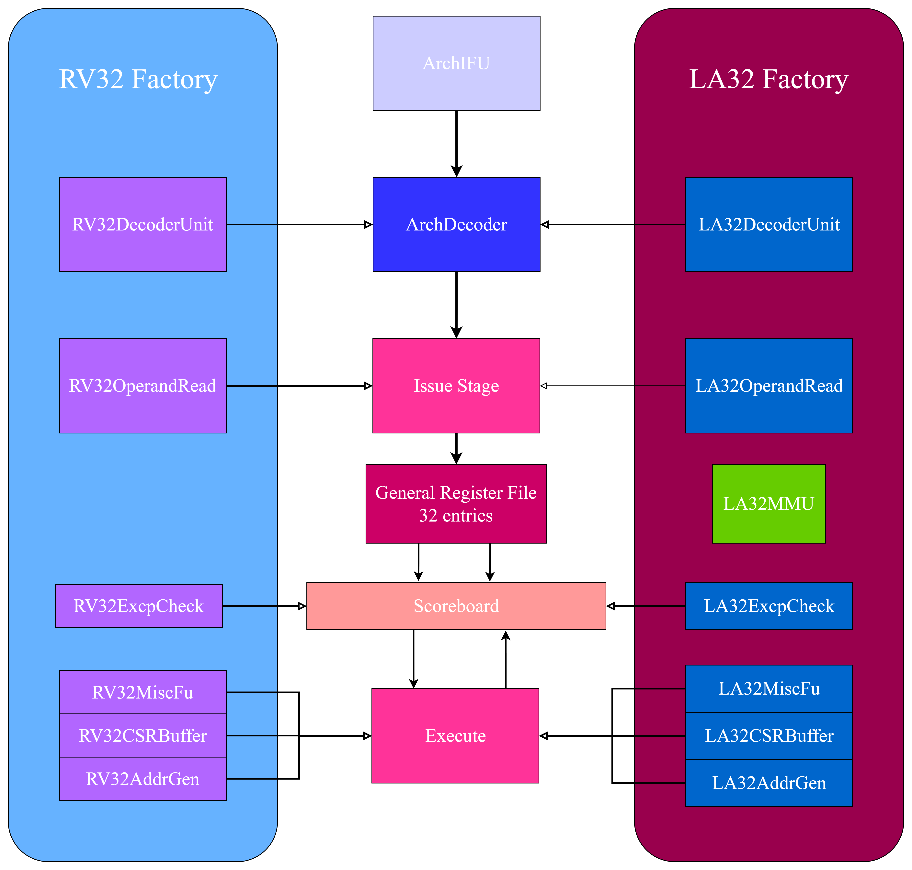
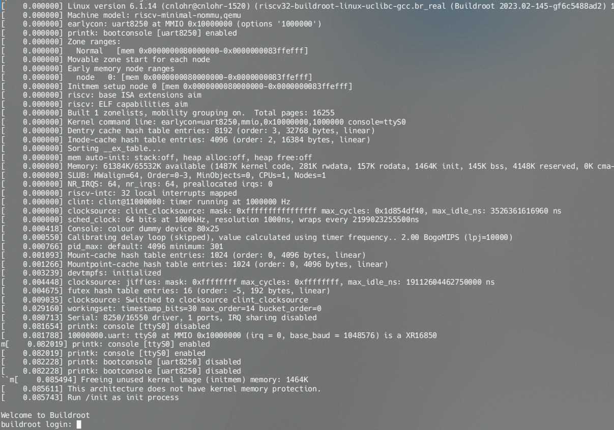
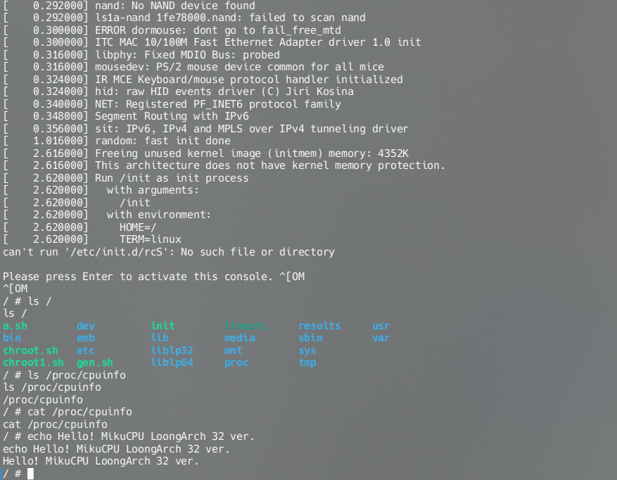

# MikuCPU

This project implements a processor that can run both RISC-V and LoongArch architectures on the same data path, utilizing Chisel's powerful type capabilities. It is my degree project for my bachelor's study.

## Overview

The overall datapath is referred from [cva6](https://github.com/openhwgroup/cva6) with some modifications.

For riscv, it implements most instructions in RV32IMAzicsr and has the ability to boot no-mmu linux system in simulation.

For loongarch, it implements all instructions in [loongarch 32 bits lite instruction set](https://github.com/loongson-community/docs/blob/master/loongarch/%E9%BE%99%E8%8A%AF%E6%9E%B6%E6%9E%8432%E4%BD%8D%E7%B2%BE%E7%AE%80%E7%89%88%E5%8F%82%E8%80%83%E6%89%8B%E5%86%8C_v1.03.pdf) (Chinese). It has implemented TLB and also can boot linux kernel in simulation. 

The implemented instructions can also be found in *Decoder.scala* in the folder *playground/src/ISA/\<isa_name\>*. 





## Usage

- Generate Verilog codes

```
# To generate riscv processor
make riscv

# To generate loongarch processor
make loongarch

```

The generated verilog file is in *build/npc_core.v* for riscv and *build/core_top.v* for loongarch.

## Simulation

The project use [verilator](https://github.com/verilator/verilator) for simulation.

For riscv, the simulator is located in folder *simulators/npc*.

For loongarch, [chiplab](https://github.com/Sevenqi7/chiplab) from Loongson is used.

A technique called **differential test** is applied in both architecture simulation to help verify and debug the design, which is to run a software architecture simulator (QEMU/Spike/etc.) with the HDL simulation at the same time, and compare their states after every executed instructions. If the HDL-implemented processors behave differently with the software ISA simulator, there must be design errors and the simulation will stop. For this project we use [NEMU](https://github.com/NJU-ProjectN/nemu.git) as the reference. 

## Booting Linux

- riscv
An image named *rv32-nommu-linux.bin* is provided under the directory *simulators/npc*. Run the following command in *simulators/npc*. Make sure the *riscv32-nemu-interpreter-so* if you want to simulate with differential test.
```
make run IMG=./rv32-nommu-linux.bin
```



- loongarch

The simulated kernel is directly from chiplab. Install all its toolchains and run the following commands:

In *sims/verilator/run_prog*:
```
./configure.sh --run linux
make

```


## Known Issues

- Currently the performance is not good since I focus more on functionality correctness when developing. Thus, some designs in the datapath are redundant and inefficient.
- The actual multiplier is not yet finished and is currently implemented directly with the operator *\** and has 10 cycles delay from input to output. 
- For riscv simulation, only uart and clint are implemented (both in software, not HDL modules). So the  simulation of booting linux cannot further when it requires a password since there is not a keyboard.